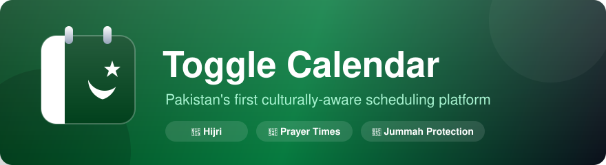

<div align="center">



# 🌙 Toggle Calendar

**Pakistan's first culturally-aware scheduling platform** — Hijri dates, prayer times, Jummah protection, and WhatsApp reminders in a beautiful, installable PWA.

[](LICENSE)
[](https://developer.mozilla.org/en-US/docs/Web/JavaScript)
[](manifest.json)
[](#)

[](https://github.com/Dattebayoolo/Toggle-Calendar/stargazers)
[](https://github.com/Dattebayoolo/Toggle-Calendar/network/members)
[](https://github.com/Dattebayoolo/Toggle-Calendar/issues)

</div>

---

## ✨ Features

| | Feature | Description |
|---|---|---|
| 🕌 | **Prayer Times** | Astronomical solar calculations for 11 Pakistani cities + Azan reminders |
| 🌙 | **Hijri Dates** | Dual Gregorian & Islamic date sync with Ruet-e-Hilal lunar sighting adjustment |
| 🤲 | **Jummah Protection** | Real-time meeting conflict warning & auto-shift buffer (12:45–2:30 PM) |
| 🔁 | **Recurring Events** | Daily, weekly, monthly & yearly repeating events with occurrence management |
| ✍️ | **Smart NLP Input** | English & Roman Urdu natural language parser ("Meet Tariq kal shaam 5 baje") |
| 🌙⚡ | **Ramadan & Load Shedding** | Live Sehri/Iftar countdowns & city feeder outage window monitoring |
| 🇵🇰 | **Provincial Holidays** | Filter holidays by Federal, Sindh, Punjab, KPK, Balochistan & AJK/GB |
| ↕️ | **Drag & Drop + Resize** | Move events across days or hours, drag vertical bottom handle to resize |
| 🌐 | **Urdu (اردو) RTL Mode** | Full native right-to-left layout and Urdu language localization |
| 🔔 | **Reminders & Digest** | Web push notifications, interval reminders & 8:00 AM PKT daily agenda |
| 📲 | **Installable PWA** | Service Worker offline cache, standalone mobile/desktop install |
| 💬 | **WhatsApp RSVP Sharing** | Instant one-tap RSVP and meeting detail sharing on WhatsApp |

## 🛠️ Tech Stack

<div align="center">


**Plus Jakarta Sans · Outfit · Noto Naskh Arabic** — 100% client-side, zero build step, zero external dependencies.

</div>

## 🚀 Getting Started

Toggle Calendar is a pure client-side web application — clone and open:

```bash
# 1. Clone the repository
git clone https://github.com/Dattebayoolo/Toggle-Calendar.git
cd Toggle-Calendar

# 2. Start the local dev server & page router (zero external dependencies)
npm run dev
```

Then open your browser:
- 🚀 **Landing Page & Brand Showcase**: `http://localhost:3000/`
- 📅 **Calendar Web Application**: `http://localhost:3000/app`

> 💡 **For offline PWA features**: click **Install** in the calendar topbar to install on desktop or mobile.

## 📂 Project Structure

```
Toggle-Calendar/
├── 📄 index.html          # App shell, PWA meta tags & modals
├── 🚀 landing.html        # Marketing landing page & brand showcase
├── 🎨 style.css           # Modern design system, light/dark themes, RTL & drag styles
├── 🎨 landing.css         # Responsive landing page layout & showcase styles
├── 📱 manifest.json       # Web App Manifest for mobile & desktop installation
├── ⚙️  sw.js               # Service Worker with cache-first offline support
├── 🖼️  icons/             # PWA app icons (192px, 512px, vector badge)
├── 📦 js/                 # Modular source architecture
│   ├── constants.js       # Provincial holidays, city coordinates, Urdu dictionary
│   ├── state.js           # Single source of truth + localStorage persistence
│   ├── utils.js           # NLP parser, astronomical prayer engine, Ramadan & RRULE
│   ├── listeners.js       # PWA prompt, notifications scheduler, keyboard shortcuts
│   ├── main.js            # Boot sequence & demo data seeding
│   ├── render.js          # Render orchestrator
│   ├── views/             # monthView · weekView · dayView · agendaView · miniCal
│   └── components/        # modal (NLP/recurrence) · popover · sidebar (Ramadan/holidays)
└── 🖼️  assets/             # Brand banner & graphics
```

## 🗺️ Completed in V0.2

- [x] PWA offline caching with Service Worker (`sw.js`) & manifest
- [x] Recurring events engine (Daily, Weekly, Monthly, Yearly + `RRULE` ICS export)
- [x] English & Roman Urdu natural language event parser (NLP) with auto-fill
- [x] Ramadan mode: Sehri & Iftar calculations, live countdowns & calendar overlays
- [x] Urdu language toggle (اردو) with native RTL layout
- [x] Provincial holiday selector (Federal, Sindh, Punjab, KPK, Balochistan, AJK/GB)
- [x] Pointer-event drag & drop across days/hours + vertical resize duration handle
- [x] Web Notifications & reminders scheduler (5m, 15m, 30m, 60m + 8:00 AM PKT digest)

## 🤝 Contributing

Contributions are what make open source amazing! Any contributions are **greatly appreciated**:

```bash
# 1. Fork the project
# 2. Create your feature branch
git checkout -b feature/amazing-feature

# 3. Commit your changes
git commit -m "✨ Add amazing feature"

# 4. Push and open a Pull Request
git push origin feature/amazing-feature
```

## 📄 License

Distributed under the MIT License. See [`LICENSE`](LICENSE) for more information.

---

<div align="center">

**Made with 💚 in Pakistan**

⭐ Star this repo if you find it useful!

[](https://github.com/Dattebayoolo/Toggle-Calendar/issues)
[](https://github.com/Dattebayoolo/Toggle-Calendar/issues)

</div>
